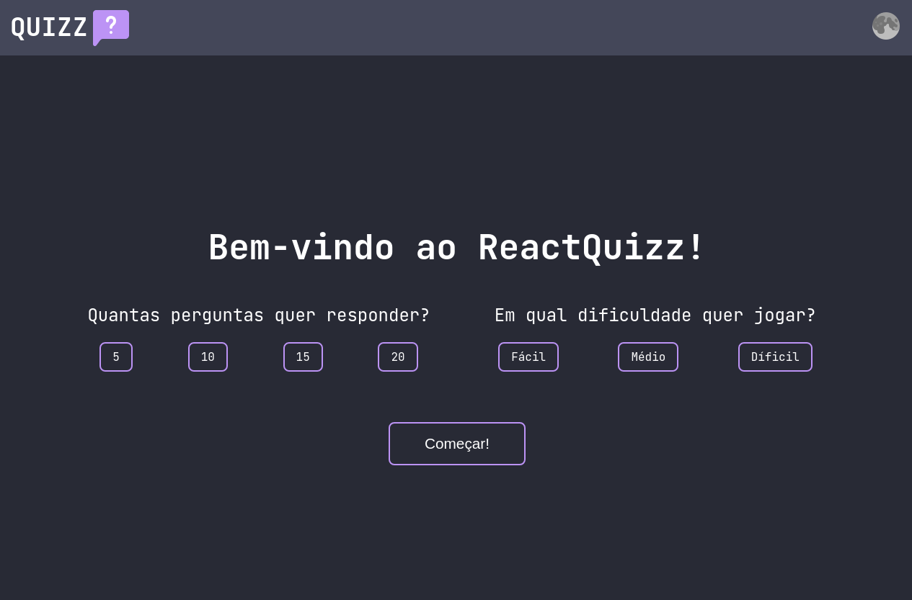

<h1 align="center">React Quiz 🎯</h1>
<h2 align="center">🚧 Under development 🚧</h2>



## Objective

Quiz app, counting the wrong and correct answers and store this in localStorage. In the finish, show a report with all questions and answer chosen.

## What i expect learn?
  - Styled Components;
  - React Router DOM;
  - Context API;
  - useRef Hook;
## API Endpoint

The questions can be viewed in this endpoint: ```https://opentdb.com/api.php?amount=QUANTITY```.

## Techs

This project was developed with ReactJS. Techs used: React Router DOM, Styled Components and Axios.

## Commits Pattern

I use the Conventional Commits for this, you can see more [here](https://www.conventionalcommits.org/en/v1.0.0/).

## Installation

#### Install Dependecies
Clone this repo, and in the project directory, run ```npm install``` for install all dependecies needed.

#### Run!

Run ```npm run dev``` and happy coding!